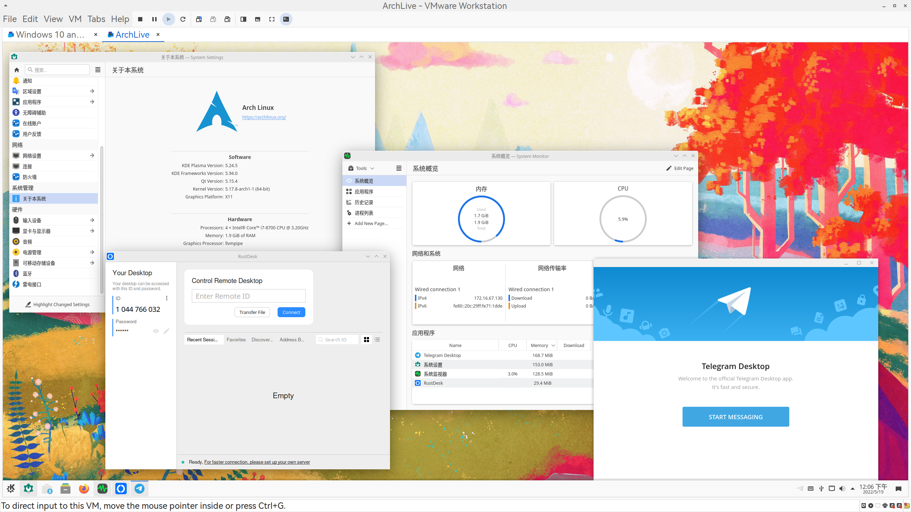

# GaoJiaQi-Archiso
> Thanks 高嘉麒 for translating!

This is a [ArchISO](https://gitlab.archlinux.org/archlinux/archiso)-based live-CD project.It contains some popular IM and remote control applications in China to make it possible and easier for asking for help.It also contains some useful applications for testing,maintaining the system,proxy and more useful repos.

## Screenshots



## To Do List

- [ ] build nightly version through github actions
- [ ] solve some know issues
- [x] sign for iso
- [ ] rebuild `build.sh`
- [ ] add support for installing packages from other source


## Get ISO
1. You can find the url to download iso built by us from[GitHub Release](https://github.com/world-nb-organization/GaoJiaQi-Archiso/releases)

2. （**Recommend**）You can also build it manually

## Building Instructions

- Build manually


There are three packages in this repo that are included in aur: [clash-for-windows-chinese](https://aur.archlinux.org/packages/clash-for-windows-chinese), [rustdesk-bin](https://aur.archlinux.org/packages/rustdesk-bin) and [wechat-uos](https://aur.archlinux.org/packages/wechat-uos),So please provide your own repo with these three packages or create a local software repo:
> All three packages are located in aur-packages.x86_64, so they will not be installed by default if you do not copy these packages to packages.x86_64 . Use the following command to add custom software sources to install packages from other source or aur.

```bash
repo-add /path/to/local.db.tar.gz /path/to/packagetoadd.pkg.tar.zst
```

Then add [local] repository to pacman.conf，refer to [Custom local repository](https://wiki.archlinux.org/title/Pacman/Tips_and_tricks#Custom_local_repository)

After preparing the local repository, run `sudo mkarchiso -v -o . /images . /` , to build the iso. If all goes well, the iso file will be located in the `images` folder.

- (**experienments**) You can use the script we provided

Run ```sudo bash build.sh``` **in the working directory** to build it.The iso will be in the `images` folder if it succeed.

> Note：If you want to install packages from aur,please add them to the `aur-packages.x86_64`file before you run the script.

