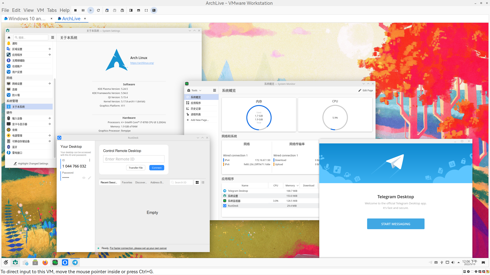

# GaoJiaQi-Archiso

这是一个自用的基于[ArchISO](https://gitlab.archlinux.org/archlinux/archiso)的live-CD项目，本项目包含常用的聊天软件和远程控制软件，便于远程维修或者求助。iso中包含常用的测试、维护和代理软件，以及一些实用的软件源。

## 屏幕截图



## To Do List

- [ ] 用github-actions自动构建每日版本
- [ ] 解决一些小问题
- [x] 给iso签名

## Issues

- Issue1
- Issue1
- Issue1

## 获取ISO
1. 您可以直接从[GitHub Release](https://github.com/world-nb-organization/GaoJiaQi-Archiso/releases)找到我们编译的ISO的下载地址

2. （**推荐**）您也可以通过我们给出的配置文件自行构建:

本repo中有三个位于aur里的包：分别是[clash-for-windows-chinese](https://aur.archlinux.org/packages/clash-for-windows-chinese),[rustdesk](https://aur.archlinux.org/packages/rustdesk)和[wechat-uos](https://aur.archlinux.org/packages/wechat-uos),因此请您自备具有这三个包的软件源或者创建本地软件源:

```bash
repo-add /path/to/repo.db.tar.gz /path/to/packagetoadd.pkg.tar.zst
```

然后用本地软件库的路径替换掉repo中的pacman.conf中的[locale]软件源，参见[构建本地仓库](https://wiki.archlinux.org/title/Pacman_(%E7%AE%80%E4%BD%93%E4%B8%AD%E6%96%87)/Tips_and_tricks_(%E7%AE%80%E4%BD%93%E4%B8%AD%E6%96%87)#%E8%87%AA%E5%BB%BA%E6%9C%AC%E5%9C%B0%E4%BB%93%E5%BA%93)

在准备好本地软件源后，运行`sudo mkarchiso -v -o ./images ./` ,来构建iso,构建完毕后，iso文件将位于`images`文件夹内。

